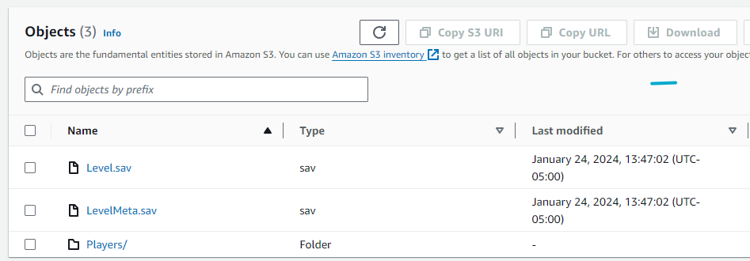
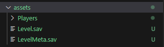

# Starting Palworld Server From Existing Save Data ( Restoring from Backup )
This is an example of creating a Palworld server using existing game save data. Useful when restoring from a backup or migrating from another server.

## Details
These inputs are required when migrating from an existing server with existing data or recovering from a deleted server.

>[!DANGER]
> You MUST know the DedicatedServerName value set in your old palworld servers `Pal/Saved/Config/LinuxServer/GameUserSettings.ini` file. This is also the name of the directory from the old server that contained your .sav files.

>[!NOTE]
> Using this modules `enable_s3_backups = true` option will backup the `GameUserSettings.ini` file to S3 as well in the event the server is lost.

## Using You Own S3 Bucket ( Bring Your Own )

Set `backup_files_storage_type = "s3"` if you have an AWS s3 bucket somewhere with the backups files already in it. Please note the warning below about the REQUIRED file structure of the bucket. Terraform and user_data are opinionated in how they retrieve and place these files, so you must adhere to this structure.

> [!WARNING]
> When `backup_files_storage_type = "s3"` using The objects in the S3 bucket must not be compressed and must be in the root of the S3 bucket. The bucket's file structure MUST match the picture below. It will be synced to the `SaveGame/0/<dedicated_server_name>` directory.



## Using Local Files

Set `backup_files_storage_type = "local"` if the save files are on your local host PC. Please note the warning below about the REQUIRED file structure of the bucket. Terraform and user_data are opinionated in how they retrieve and place these files, so you must adhere to this structure.

> [!WARNING]
> When `backup_files_storage_type = "local"` using The objects/files in the directory you specify with `backup_files_local_path` must not be compressed. Terraform will iterate through each file in that directory and upload it to the root of an S3 bucket it creates. It will do this for `backup_files_local_path/Players` as well.

Required local file structure



- `backup_files_storage_type = "local"` will instruct terraform to create an S3 bucket named `palworld-bootstrap-local-saves-<region>-<accID>` and upload the save files from your local PC `backup_files_local_path` directory specified to that bucket. The user_data script on the EC2 instance will download the files from that S3 bucket when the server starts and place them in the `/palworld-server/Pal/Saved/SaveGames/0/<dedicated_server_name_hash>` directory.

- `backup_files_storage_type = "s3"` Is informing terraform that you have an existing S3 bucket somewhere that contains the save game data. The EC2 user_data script will attempt to sync the root of that S3 bucket with the `SaveGames/0/<dedicated_server_name_hash>` directory. It will also attempt to sync the S3 buckets `Players` folder to `SaveGames/0/<dedicated_server_name_hash>/Players` That is why it is important that the objects be uncompressed and in the proper structure. 

> [!WARNING]
> When `backup_files_storage_type = "local"` using The objects/files in the directory you specify with `backup_files_local_path` must not be compressed. Terraform will iterate through each file in that directory and upload it to the root of an S3 bucket it creates.

## Usage - Restore From Local Files
Relevant inputs:

```HCL
  start_from_backup         = true
  backup_files_storage_type = "local"
  dedicated_server_name_hash = "FA8C44A6FA46436AAAE4D414C4214B25"
  backup_files_local_path   = "../../assets"
```

## Usage - Restore From an Existing S3 Bucket ( Bring Your Own S3 Bucket)
Relevant inputs:

```HCL
  start_from_backup         = true
  backup_files_storage_type = "s3"
  dedicated_server_name_hash = "FA8C44A6FA46436AAAE4D414C4214B25"
  existing_backup_files_bootstrap_bucket_arn  = "arn:aws:s3:::palworld-existing-s3-bucket-bootstrap"
  existing_backup_files_bootstrap_bucket_name = "palworld-existing-s3-bucket-bootstrap"
```